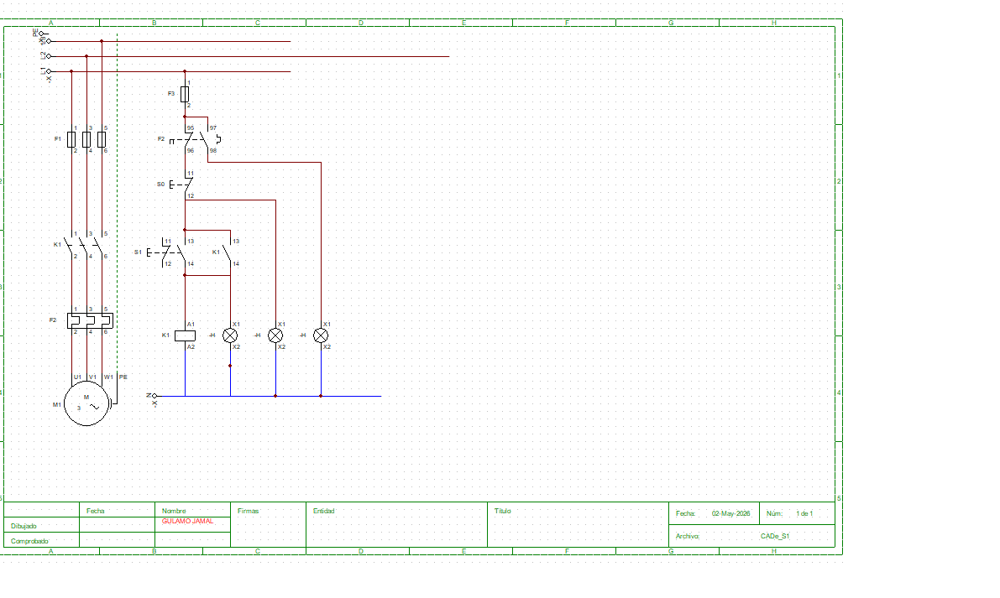

# Circuitos Elétricos Básicos

Este repositório apresenta exemplos práticos de circuitos elétricos utilizados em instalações e automação industrial.
Gulamo Jamal | gulamo.jamal@outlook.com

---

##  Projeto 1: Comando Liga/Desliga

###  Objetivo
Implementar um circuito simples para ligar e desligar uma carga utilizando botão START e STOP.

---

###  Componentes
- S0 → Botão STOP (Normalmente Fechado)
- S1 → Botão START (Normalmente Aberto)
- K1 → Contator
- Contato auxiliar de K1

---

###  Funcionamento
1. Ao pressionar START (S1), o contator K1 é energizado.  
2. O contato auxiliar mantém o circuito ligado (auto-retenção).  
3. Ao pressionar STOP (S0), o circuito abre e desliga o sistema.

---

### 🖼️ Diagrama

---

brevemito.com
