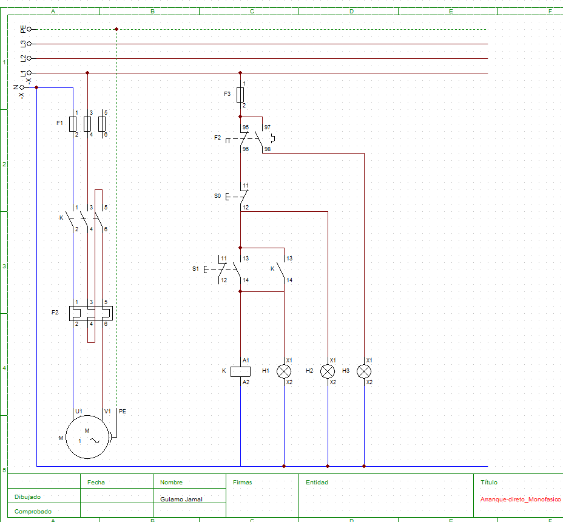

# Arranque Direto de Motor Monofásico

##  Objetivo
Implementar um sistema de comando para arranque directo de um motor monofásico com sinalização de estado e proteção contra sobrecarga e curto-circuito.

---

##  Componentes
- S0 → Botão STOP (Normalmente Fechado)
- S1 → Botão START (Normalmente Aberto)
- K1 → Contator
- F2 → Relé térmico (proteção contra sobrecarga)
- F1,F3 → Fusíveis (proteção contra curto-circuito)
- M → Motor monofásico (U1 - Neutro, V1 - Fase, PE - Aterramento)

###  Sinalização
- H1 → Motor em funcionamento
- H2 → Sistema pronto para funcionamento
- H3 → Sobrecarga (ligado ao contacto NA 97-98 do relé térmico)

---

##  Funcionamento
1. Quando o sistema é energizado, H2 acende indicando que está pronto para operação.
2. Ao pressionar START (S1), o contator K1 é energizado.
3. O motor entra em funcionamento e H1 acende.
4. O contacto auxiliar de K1 (13-14) mantém o circuito activo (auto-retenção ou selo).
5. Ao pressionar STOP (S0), o circuito abre e o motor desliga.
6. Em caso de sobrecarga, o relé térmico atua, desliga o sistema e H3 acende.

---

##  Proteções
- Fusíveis para proteção contra curto-circuito
- Relé térmico ajustado à corrente nominal do motor
- Ligação à terra (PE) para segurança

---

## 🖼️ Diagrama

---

##  Aplicações
- Bombas de água
- Compressores
- Sistemas domésticos e industriais de pequena escala

---

## 📬 Autor
Gulamo Jamal | brevemito.com | gulamo.jamal@outlook.com 
