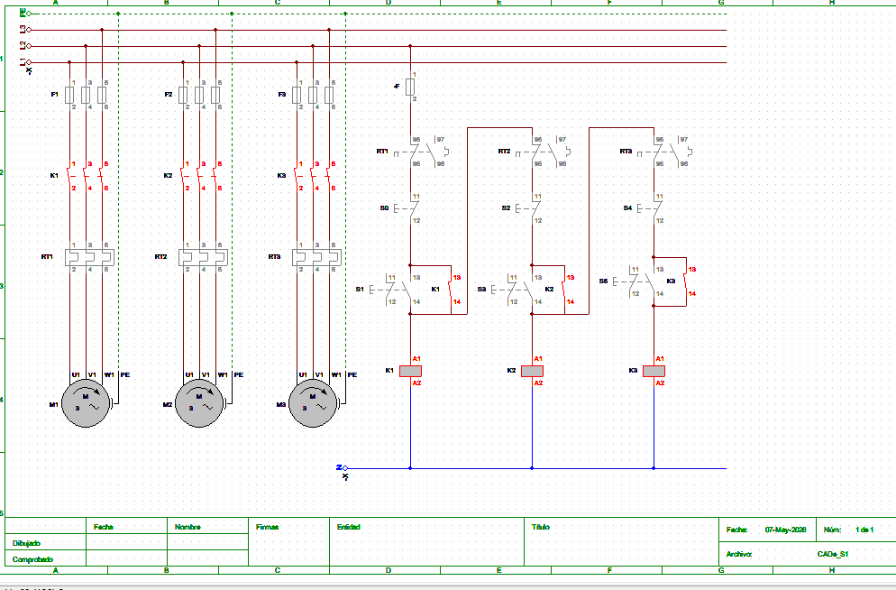

# Arranque Sequencial de 3 Motores Trifásicos

## Descrição

Sistema de comando eléctrico industrial para arranque sequencial manual de três motores trifásicos (M1, M2 e M3), utilizando interbloqueio lógico entre contactores.

- M2 depende de M1  
- M3 depende de M2  
- Sem utilização de relé temporizador  

---

## Componentes

- Motores: M1, M2, M3  
- Fusíveis: F1, F2, F3  
- Contactores: K1, K2, K3  
- Relés térmicos: RT1, RT2, RT3  
- Botoeiras NF: S0, S2, S4  
- Botoeiras NA: S1, S3, S5  

---

## Diagrama

