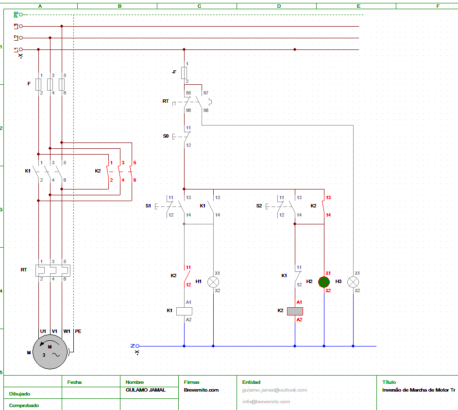

# Inversão de Marcha de Motor Trifásico

## Objetivo
Implementar um sistema de comando para inversão do sentido de rotação de um motor trifásico, com intertravamento elétrico e proteção.

---

## Componentes
- S0 → Botão STOP (Normalmente Fechado)
- S1 → Botão START (sentido directo)
- S2 → Botão START (sentido inverso)
- K1 → Contactor (rotação direta)
- K2 → Contactor (rotação inversa)
- RT → Relé térmico (proteção contra sobrecarga)
- F → Fusíveis (proteção contra curto-circuito)
- M → Motor trifásico (U1, V1, W1 – fases / PE – aterramento)

###  Sinalização
- H1 → Motor em rotação direta
- H2 → Motor em rotação inversa
- H3 → Sobrecarga (contacto NA 97-98 do relé térmico)

---

## 🔁 Funcionamento
1. Ao energizar o sistema, o circuito fica pronto para operação.
2. Ao pressionar S1, o contactor K1 é energizado, alimentando o motor no sentido directo.
3. H1 acende indicando funcionamento directo.
4. Ao pressionar S2, o contactor K2 é energizado, invertendo duas fases do motor.
5. H2 acende indicando rotação inversa.
6. O intertravamento elétrico impede que K1 e K2 funcionem simultaneamente.
7. Ao pressionar STOP (S0), o sistema desliga.
8. Em caso de sobrecarga, o relé térmico atua e H3 acende.
9. Para comutar de um sentido para outro primeiro deve clicar S0

---

## ⚠️ Proteções e segurança
- Intertravamento elétrico entre K1 e K2 (contactos NF cruzados)
- Fusíveis para curto-circuito
- Relé térmico ajustado à corrente do motor
- Ligação à terra (PE)

---

## 🖼️ Diagrama

---

## 📌 Aplicações
- Pontes rolantes
- Elevadores
- Sistemas de transporte
- Máquinas industriais

---

## 📬 Autor
Gulamo Jamal | gulamo.jamal@outlook.com | gulamojamal@gmail.com | brevemito.com | info@brevemito.com
