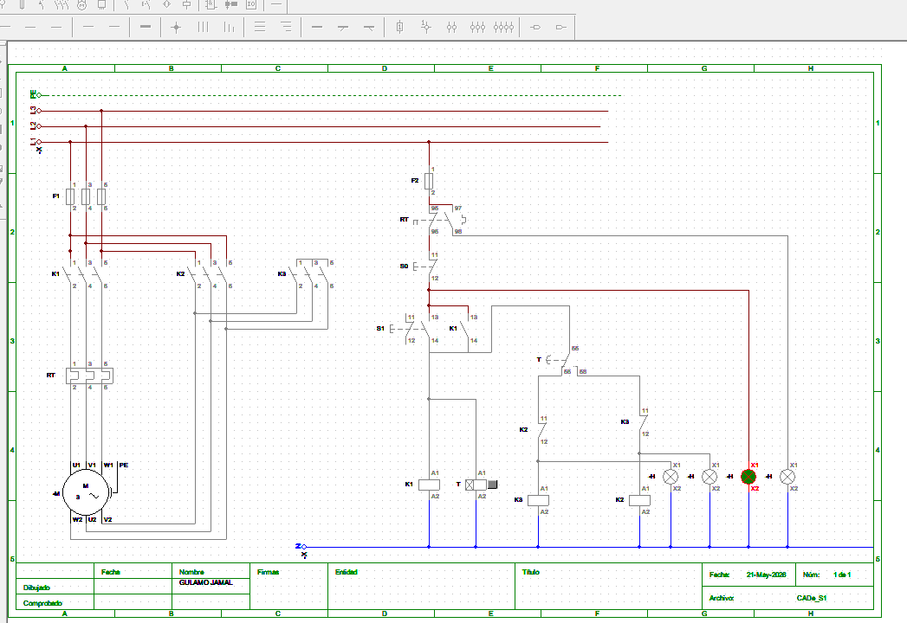

# Partida Estrela-Triângulo

## Descrição

Projecto de comando e potência para partida estrela-triângulo de motor trifásico.

O sistema inicia o motor em ligação estrela para reduzir a corrente de arranque e, após temporização, realiza a transferência automática para triângulo.

---

## Funcionamento

1. Pressionar START
2. O contactor principal K1 energiza
3. O contactor estrela K3 energiza
4. O motor arranca em estrela
5. O temporizador inicia a contagem
6. Após aproximadamente 10 segundos:
   - K3 desliga
   - K2 liga
7. O motor passa a operar em triângulo

---

## Componentes

| Componente | Função |
|---|---|
| K1 | Contactor principal |
| K2 | Contactor triângulo |
| K3 | Contactor estrela |
| RT | Relé térmico |
| T | Temporizador |
| S0 | Botão STOP |
| S1 | Botão START |

---
## Diagrama de Comando

---

## Segurança

Nunca permitir accionamento simultâneo dos contactores estrela e triângulo.

O circuito deve possuir interbloqueio.

---

## Aplicações

- Bombas industriais
- Ventiladores
- Compressores
- Motores trifásicos

---

## Repositório
Gulamo Jamal | Gulamo.jamal@outlook.com | 
